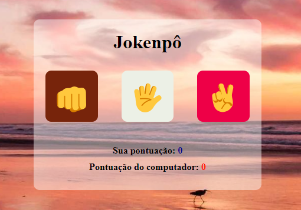

# Jokenpô

Este projeto surgiu a partir de um exercício de Jokenpô que desenvolvi em Python durante um curso do Gustavo Guanabara. Posteriormente, adaptei a lógica para JavaScript e criei uma versão web utilizando HTML e CSS.

O jogador pode escolher entre pedra, papel ou tesoura para disputar contra o computador. A aplicação determina o resultado de cada rodada e mantém o placar das partidas.

## Funcionalidades

- Escolha entre pedra, papel e tesoura
- Jogada aleatória do computador
- Identificação de vitória, derrota ou empate
- Atualização automática do placar
- Reinício da partida
- Imagem aleatória de fundo

## Tecnologias Utilizadas

- HTML5
- CSS3
- JavaScript

## Demonstração

 

## Link do projeto

Este é o link do meu projeto <a href= "https://anajulialeite.github.io/jokenpo/">Jokenpô</a>

## License

